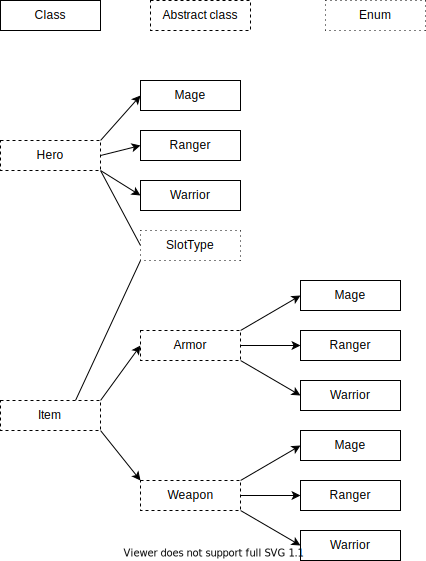

# RPG Characters

This program is a simple RPG character system. It is very basic, where the programs can create characters and items (weapons and armors), and then combine items to a character. The program can not attack other characters, but it prints detailed information on all the characters, including how much damage a character can make.  
  
The characters has different values of health, strength and intelligence based on the level.  All items have a name, level and a particular slot for the item.  
For weapon, the particular slot is weapon, and for armor can particular slot be either head, body or legs.  All weapons has a damage which is based on the level, and also the stats to the character that has the weapon.  
Armors can apply bonuses to Health, Strength, Dexterity, and/or Intelligence.  Then a character can for example get better health when having a leather on body.  If armor is on head, the bonus is only 80% of the bonus for the item.  If armor is on legs, the bonus is only 60% of the bonus for the item.  
  
  
The different characters that is implemented is:  
- Warrior  
- Ranger  
- Mage  
  
The different weapons that is implemented is:  
- Melee  
- Ranged  
- Magic  
  
The different armors that is implemented is:  
- Cloth  
- Leather  
- Plate

# Implementation

The program is based on two classes, Item and Hero (Characters).

## Hero

The Hero class is an abstract class, which has the common functionality for all characters, with the functions:

- int **getLevel**()
- void **addItem**(Item item)
- void **removeItem**(Item item)
- void **addXp**(int xp)
- int **getXpForNextLevel**()
- int **getHealth**()
- int **getStrength**()
- int **getIntelligence**()
- int **getDamage**()
- String **getDetailsAsString**()

When a character gets a item, then the get functions is calculating the stats including the bonus stats from the item. An item is stored in a hashmap with a SlotType as key, and the item as value. SlotType is an enum, that has different slots a character can have.  When adding more xp for a character, a character leveling up to the correct level based on the xp.  
  
The Hero class has three different heroes as subclasses.  
This subclasses calls on the Hero class with unique values for baseHealth, baseStrength, baseDexterity and baseIntelligence,  
that the constructor for a Hero take. Each Hero also have a updateData function which updates the data when leveling up.

## Item

The item class is an abstract class, which has the common functionality for all items, as:

- slotType **getParticularSlotType**()
- String **getName**()
- int **getLevel**()
- void **levelUp**()

A item can be an armor or a weapon.

## Armor

The Armor class is also abstract, and has get functions for health, strength, dexterity, intelligence, and getDetailsAsString. This class has Cloth, Leather and plate as subclasses, where each subclass has its own function updateData, which is calculating the data based on the level.

## Weapon

The Weapon class is also abstract, and has get functions for damage and getDetailsAsString.  This class has Magic, Melee and Range as subclasses, where each subclass has its own function updateData, which is calculating the damage based on the level.

# Run the program

A demonstration for the program is in Main class, which can be executed from the jar file in the out/artifacts/Assignment3_jar/Assignment3.jar.

# Test the program

For testing, the program has a own directory called Tests. This directory has tests for all the class, for many conditions.  The testing is using JUnit.

# Diagram

